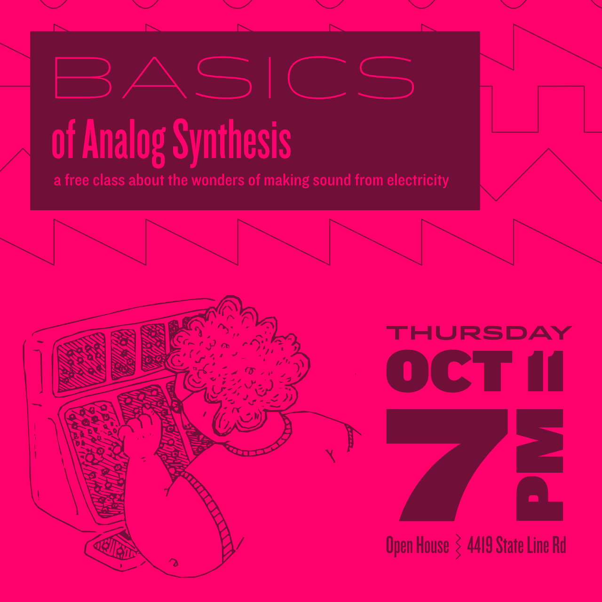

# Introduction

- Hi! I'm Ross Brown. I play in the bands [Fullbloods](http://www.fullbloods.com), [Shy Boys](https://www.shyboys.website), and [Snacky](http://www.snackymusic.com).
- Studied Audio Engineering for 2.5 years at [Institute of Audio Engineering Arts](http://recordingeducation.com)
- Class goal: understanding the basics of subtractive analog synthesis as used in music and sound design

## What is sound?

- Vibrations at audible frequencies
- Push and pull of air: oscillations
- Hz is measurement of cycles (oscillations) per second
- Sound waves have physical size: speed of sound = 1125.328 feet per second. 100hZ = 11 ft long

## What is synthesis?

- “the combination of ideas to form a theory or system”
- Using electrical energy to produce sound energy - transformation of energy from one form to another

## What is “analog” synthesis

- Analog = “relating to or using signals or information represented by a continuously variable physical quantity such as spatial position or voltage.”
- Electrical current has an analogous relationship to sound energy: minimum and maximum voltage in electrical currents; push and pull
- More about difference between analog/digital later

# Dissecting the classic synth design

### Concepts:

- Pitch
- Timbre
- Amplitude
- Duration
- Modulation
  http://www.indiana.edu/~emusic/etext/synthesis/chapter4_terms.shtml

## Pitch

### Oscillators (VCOs)

Oscillators are the primary tone generators in synths

- convert a DC input (the supply voltage) into an AC output (the waveform)
- Generate waveforms
- Frequency at which they oscillate determines pitch: 440Hz = A4
- A frequency doubled is an octave above the original pitch
- Human hearing range is about 20Hz - 20kHz
- Since synthesizers aren’t a physical instrument, the pitches they can generate are pretty much infinite, from sub-audio to above our hearing range
- In East Coast-style synths, this is usually controlled with a keyboard \* typically equal temperament, different from a piano
  - key pressed instructs oscillator which pitch to play \* pitch is not limited to typical western 12-note scales

## Timbre

The timbre of a synthesizer starts with the waveform that an oscillator generates.

**Sine**: only the fundamental frequency in its purest form; “the graph of the sine function, usually with time as the independent variable” \* lowest frequency and generally the highest amplitude.

**Non-sinusoidal (complex)**:

- one fundamental frequency and one or more harmonic frequencies
- examples: triangle, sawtooth, ramp, square, pulse, noise
- created by combining sine waves with signals of specific frequencies
- phase cancellation causes shaping of waveforms
  

### Waveform shapes (listening exercise)

- **Sine**: very pure sounding, not super interesting. Often used as a basis for flute-like sounds
- **Triangle**: a bit more harmonically interesting than sine, more “brightness”. Sometimes used for a mellow brass sound or strings.
- **Sawtooth**: Very harmonically rich. “Buzzy”. Often used for brass sounds, emulates vibration of metal
- **Ramp**: opposite of sawtooth. Similar in sound.
- **Square**: “hollow” sounding. Sometimes used for basses, drums
- **Pulse**: square wave with a different “duty cycle”. A square wave has a 50% duty cycle, meaning 50% of the time is spent in the maximum voltage and 50% is spent in the minimum. Pulse waves allow variation in the time spent in the max voltage. Good for double reed sounds (bassoons, oboes)
- **Noise**: random electrical signal, or intentionally generated for a [specific color](https://en.wikipedia.org/wiki/Colors_of_noise)

[https://www.testandmeasurementtips.com/basics-non-sinusoidal-waveforms/](https://www.testandmeasurementtips.com/basics-non-sinusoidal-waveforms/)

### Filters

In subtractive synthesis, filters are used to remove a range of frequencies from audio. **(graph time!)**

#### Common Analog Filter types

- Lowpass - frequencies above the cutoff point are attenuated
- Highpass - frequencies below the cutoff point are attenuated
- Band - frequencies above and below a central frequency are attenuated
- Notch - a limited range of frequencies are attenuated

Frequencies are attenuated gradually, not immediately. Common slopes are 12dB per octave and 24dB per octave.

#### Listening exercise

#### Resonance/Q

- Control that feeds some of the output back into the input of the filter
- Emphasizes frequencies near the cutoff point: "resonates" a frequency range

#### Listening exercise

### Envelope Generators

Instead of manually sweeping filters, one can use an Envelope Generator to affect a filter. An Envelope changes a voltage over time, typically described with 4 parameters:

- Attack time: the time it takes to increase a voltage from 0 to its peak level
- Decay time: after reaching peak amplitude, the time it takes to decrease to the **sustain level**
- Sustain level: the level the voltage maintains until entering into the release phase
- Release time: the time it takes the voltage to return to 0 after the sustain phase has terminated

### Gate

Typically, Envelope Generators are controlled by the **Gate**.

> When the key is depressed (called “note on” the pulse begins its positive 5v phase and stays there until the key is released (called “note off”) where the pulse returns to 0v value. The keyboard gate signal is patched to both envelope generators, and they each move through their attack and decay times to rest at the sustain level until the envelop is ungated (“key off”), at which point they begin their decay phase. Sometimes an envelope may not make it to the sustain level before being ungated, at which point it jumps to the release phase from wherever it was, and that may cause a click if the discontinuity is too great.
>
> http://www.indiana.edu/~emusic/etext/synthesis/chapter4_terms.shtml

## Amplitude and Duration

Amplitude is used to describe the volume of the audio output at its final stage of the synthesizer. In traditional, East Coast-style analog synthesizer design, amplitude is controlled by Envelope Generators.

The loudness of the audio follows the envelope path as programmed by the player, triggered by the gate (pressing and releasing a key on the keyboard)

## Modulation

Modulation can be described as taking signal (voltage) from a modulation source and applying it to a destination. Modulation sources do not enter the audio signal path, therefore you don't hear the source voltage, only the effect it has on its destination.

**Examples**

- Vibrato: a Low-frequency oscillator (LFO, usually a triangle or sine shape) voltage modulates the pitch (frequency) of a VCO
- Tremolo: an LFO modulates the voltage (volume) of the amplitude stage
- Pitch envelope: an Envelope Generator (perhaps the same one used for amplitude or filter) modulates the pitch (frequency) of a VCO
- Pad swells: an LFO modulates the Lowpass filter cutoff frequency
- External Waveshape control: the wave shape of an oscillator is controller by a voltage external to the synthesizer (a Control Voltage, or CV)

Modulation sources are connected to their destinations in a variety of ways. In some synthesizers, common modulations are hard-wired. Others expose modulation routing by way of switches, knobs, or patch points.

# Further Reading

- [https://ask.audio/articles/analog-synthesis-part-1-the-four-properties-of-sound](https://ask.audio/articles/analog-synthesis-part-1-the-four-properties-of-sound)
- [http://www.indiana.edu/~emusic/etext/synthesis/chapter4_terms.shtml](http://www.indiana.edu/~emusic/etext/synthesis/chapter4_terms.shtml)
- This document is available online at [https://git.io/fxtfS](https://git.io/fxtfS)
