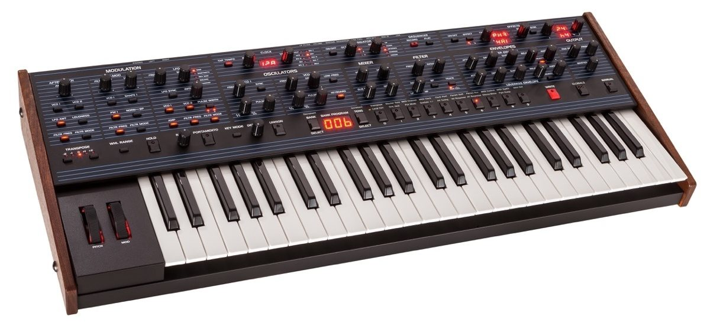
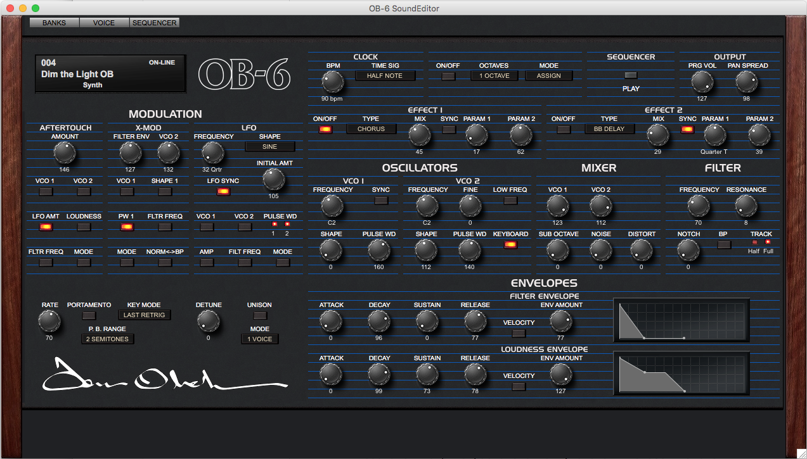
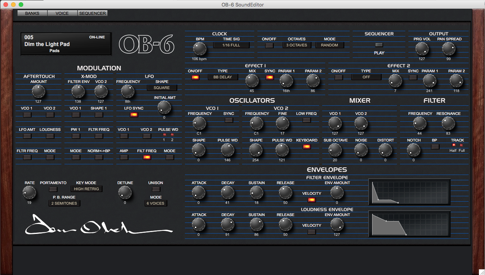
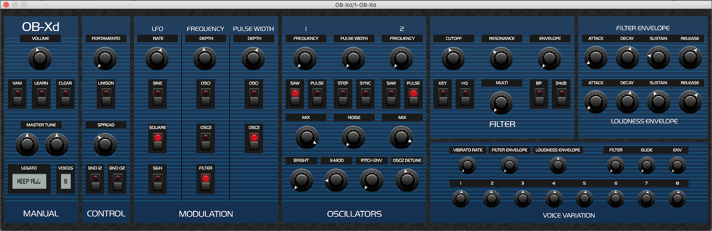

[Shy Boys](http://www.shyboys.website) just released our [latest "double single"](https://open.spotify.com/album/1Mj5RPTMNJgRjMemf1S236?locale=nl&fo=1) to the world[^single]. Both songs feature synth sounds uncommon to previous Shy tracks. I played synth on "Dim The Light" so I thought I'd break the sounds down a little bit and share the patches.

## The OB-6

The big, sizzly synth you hear right from the get-go is the Dave Smith Instruments (now rebranded as Sequential) [OB-6](https://www.sequential.com/product/ob-6/). It's a collaboration between [Dave Smith](<https://en.wikipedia.org/wiki/Dave_Smith_(engineer)>) of [Sequential Circuits](<https://en.wikipedia.org/wiki/Sequential_(company)>) fame and [Tom Oberheim](https://en.wikipedia.org/wiki/Tom_Oberheim) (of... [Oberheim](https://en.wikipedia.org/wiki/Oberheim_Electronics) fame), taking sonic inspiration from the classic [OB-X](https://en.wikipedia.org/wiki/Oberheim_OB-X) synthesizer and wrapping it up in a modern package. I've never owned an original Oberheim synth so I can't do much in way of sound comparison, but this thing sounds like nothing else I've ever played. The oscillators are beautifully sizzly and the filter makes them shine.

If you're working with a computer, check out this great [OBXD soft-synth](https://www.discodsp.com/obxd/) that can get some very similar sounds.

## Patch 1: Verse and Choruses

This patch was inspired by what I understand to be a classic Oberheim sound: lush, buzzy (but not abrasively so), and massive. As you might expect, this sound is fairly easy to get on the OB-6.

  
_Screenshot from the [OB-6 patch parameters on the SoundTower OB-6 Editor software](http://www.soundtower.com/ob6/index.html)_

  
_Screenshot of the [OBXD soft synth](https://www.discodsp.com/obxd/), a rough approximation of the OB-6 patch_

- [Download patch for OB-6](./Dim_The_Light_OB.ob6_p) (requires SoundTower OB-6 Editor and an OB-6)
- [Download AudioUnit preset for OBDX](./Dim_The_Light.aupreset) (requires the [OBDX soft synth](https://www.discodsp.com/obxd/))

### Oscillators

Pretty straightforward here: both oscillators are set to sawtooth[^osc] and tuned to the same pitch. The sub oscillator is not used in this sound because the rest of the band covers enough space in the track.

### Filters, Envelopes, and Modulation

The OB-6 has an [SEM-style](http://www.vintagesynth.com/oberheim/sem.php) variable state filter. This means you can transition between lowpass, notch, and high pass filter types smoothly by turning a knob (poorly labeled "notch" in the screenshot above). For this patch I'm using the 2-pole, 12dB per octave lowpass filter. This filter has a great character and even on its darker settings lets some of that great sizzle through. Resonance on this filter sounds great, but since I needed to blend with two other guitars in this track I opted for no resonant peak.

The filter envelope is simple on this patch: an instant attack decaying to 0 over a fairly short amount of time. The filter envelope amount is set fairly high so that when a note is played the filter opens up to reveal the oscillators in all their glory and then darkens over time. Also notice that keyboard tracking is on "full" so the keyboard is used as a subtle modulation source for the filter. When using a lowpass filter, this means notes higher up on the keyboard have less of the filter applied to them and are therefore brighter. During the verses when Collin is singing I drop the filter cutoff frequency to darken the sound and get out of the way.

The loudness envelope has a decently high sustain level so when I'm holding chords in the right hand they don't become inaudible. The handsome release time on this patch contributes to the note overlap and washiness.

There's no modulation happening at all on this patch. That might sound kind of boring but there was enough going on in the song without it.

### Effects

The OB-6 has two digital effects engines that can be mixed into the analog signal path before output. For this patch I threw on a stereo chorus and a bucket-brigade delay. The chorus is more for a throwback sound and I wouldn't hesitate to bypass it since the synth sounds massive on its own. A similar effect could be created in the analog realm by using an LFO to slowly modulate the pitch/detune of only one of the oscillators.

I also used the Pan Spread effect on the OB-6, which alternates each voice across the stereo spectrum as it's played. This way I could stay out of the center of the mix where the guitars are focused.

## Patch 2: Outro

For the outro, I wanted a sound that could start out subtle and grow over the course of the performance. It would be considerably different from patch 1, so in order to avoid scrambling with a bunch of knob turning for a smooth transition, I decided to make a separate patch in memory to switch to during this section of the song. When this patch enters, its purpose is to provide a bed of sound for the guitar solos to sit on. I'm playing open fifths with this patch to reinforce the chords but stay out of the way of the bass guitar.

  
_Screenshot from the [SoundTower OB-6 Editor software](http://www.soundtower.com/ob6/index.html)_

  
_Screenshot of the [OBXD soft synth](https://www.discodsp.com/obxd/), a rough approximation of the OB-6 patch_

- [Download patch for OB-6](./Dim_The_Light_OB_Pad.ob6_p) (requires SoundTower OB-6 Editor and an OB-6)
- [Download AudioUnit preset for OBDX](./Dim_The_Light_Pad.aupreset) (requires the [OBDX soft synth](https://www.discodsp.com/obxd/)) - the pulse width and filter cutoff modulations are mapped, you'll just need to increase the "depth" param

### Oscillators

Oscillator 1 is a sawtooth again, while oscillator 2 is a square wave tuned slightly above oscillator 1. There's a bit of sub oscillator mixed into this patch as well. The sub oscillator on the OB-6 is a square wave tuned one octave below oscillator 1.

### Filters, Envelopes, and Modulation

I stick with a lowpass filter again, this time with some resonance for more presence as I open it up later in the outro.

Don't be fooled by the filter envelope settings in the screenshot: there's not envelope applied to the filter. This is more of a pad sound so I didn't want notes to poke out as I (sloppily) played them.

The loudness envelope leans more towards an organ than a piano, with the sustain level being close to the peak level.

I needed a starting spot for getting crazy with this sound, so I threw in a square LFO to modulate the filter frequency and the pulse width of oscillator 2. Later on in the outro when things get nuts I crank up the filter resonance and LFO rate. I probably did some other stuff too, but that information is lost to time.

### Effects

I drop the chorus on this patch so I'm left with just the bucket brigade delay. Pan spread sticks around though, because why not?

## Conclusion

These aren't groundbreaking sounds by any means but they're classic for a reason and they're simple to achieve. After all, it's less about the sound than it is what you do with it. Keep on synthesizin'.

[^single]: Listen on [Spotify](https://open.spotify.com/album/1Mj5RPTMNJgRjMemf1S236?locale=nl&fo=1), [Apple Music](https://itunes.apple.com/us/album/dim-the-light-brick-by-brick-single/1451341347), [Youtube](https://www.youtube.com/watch?v=lx1lN9pErnw), and pretty much anywhere else.
[^osc]: Both oscillators a variable wave shape, meaning you can smoothly transition from a sawtooth to a pulse wave. Oscillator 2 has the ability to use a triangle wave shape at its leftmost position on the "shape" knob. This is why oscillator 2's shape knob is in a different position than oscillator 1's, yet they're both basically sawtooth.
